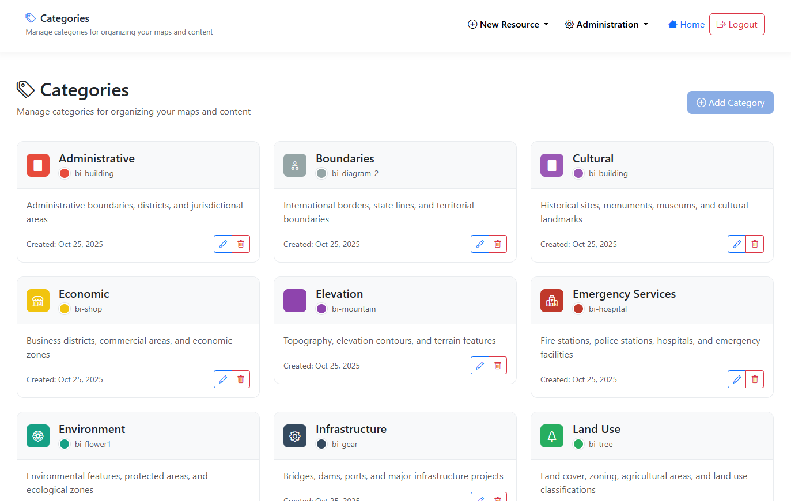
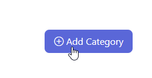
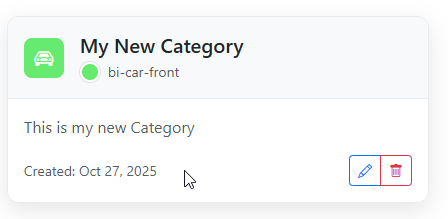
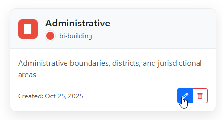
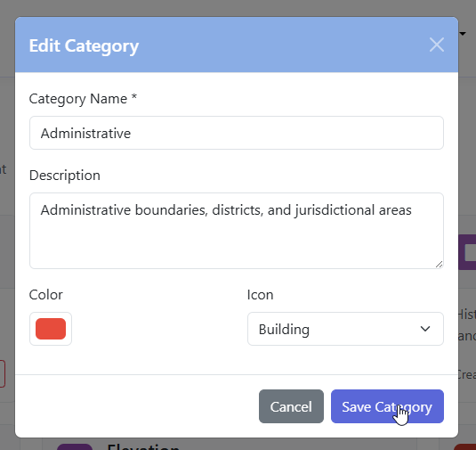
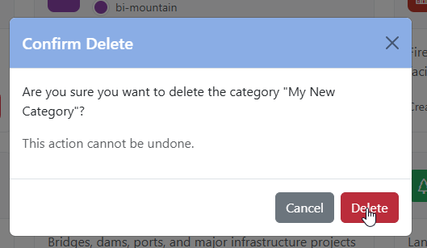
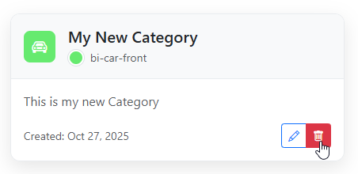

.. This is a comment. Note how any initial comments are moved by
   transforms to after the document title, subtitle, and docinfo.

.. demo.rst from: http://docutils.sourceforge.net/docs/user/rst/demo.txt

.. |EXAMPLE| image:: static/yi_jing_01_chien.jpg
   :width: 1em

**********************
Categories
**********************
.. contents:: Table of Contents
Overview
==================

Categories are used for Search and organization.

GeoLite comes preopulated with common Categories. These can be edited or deleted.

Create Category
================

To add a new Category, click the "Add New" button at top.

Give you Category a name and description and select color and icon.

Click Save

.. image:: ../../_static/GeoLite-Categories-add-2.png

The Category has been created

Edit Category
=====================

To edit a Category, click the edit icon

Make your edits and click the Save Category button

Delete Category
===================

To delete a Category, click the delete icon

Confirm deletion

