.. This is a comment. Note how any initial comments are moved by
   transforms to after the document title, subtitle, and docinfo.

.. demo.rst from: http://docutils.sourceforge.net/docs/user/rst/demo.txt

.. |EXAMPLE| image:: static/yi_jing_01_chien.jpg
   :width: 1em

**********************
Dashboards
**********************
.. contents:: Table of Contents
Overview
==================

Dashboards contain a Map widget along with Chart, Table, Counter, and HTML widgets.

When creating a Dashboard, be sure to use the Toggle function in order to see full width

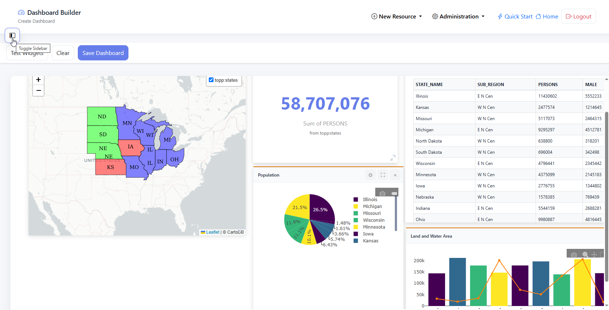

Create Dashboard
================

To add a new Map, go to Add Resource > Dashboard

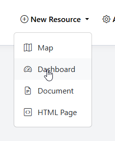

Map Widget
=========================

Click on Map to add a Map widget

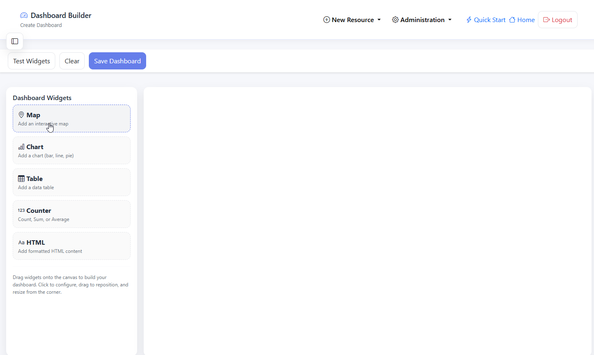

Click the Configure button

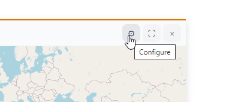

Give your map a Title, select a basemap, and select the Layer(s) you wish to use

Click Save

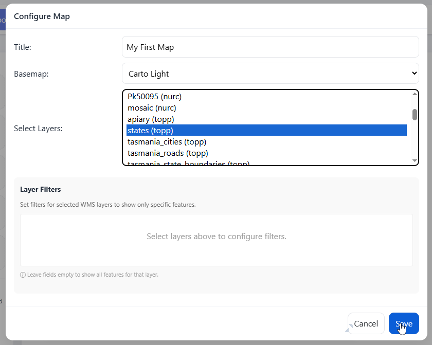

Position your map to where you would like it on page load

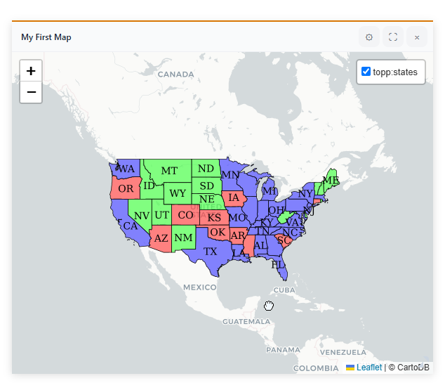

If you wish to add Filters to map, click Configure.

Add any Filters you wish to add.

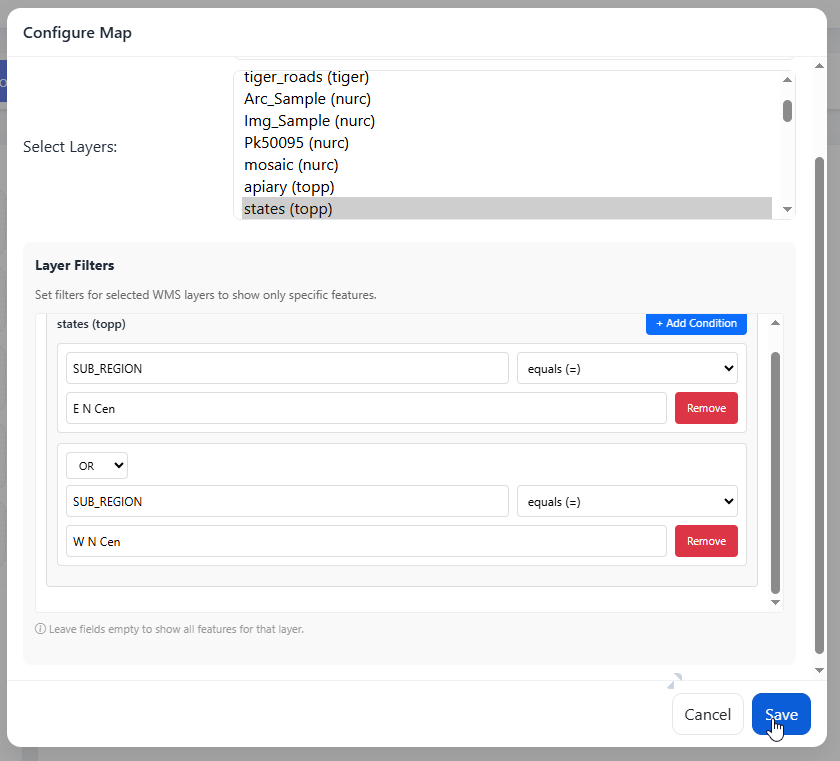

Chart Widget
=========================

Click Chart to add a Chart widget

.. image:: ../../_static/GeoLite-Dashboard-8.png

Click the configure button

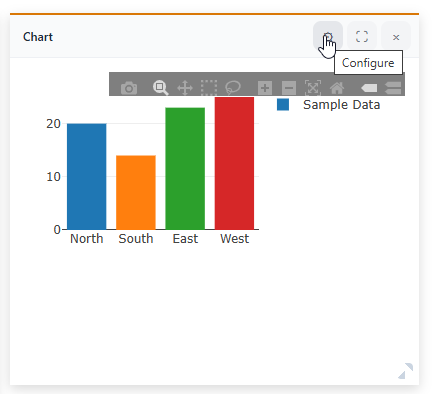

Select/Enter the following value:

   - Title
   - Chart Type
   - Show Grid
   - Chart Color Scheme
   - Data Layer (GeoServer Layer)
   - Series Label
   - Aggragation (Sum, Count)
   - Enable Second Series
   - X Value
   - Y Value

Click Save

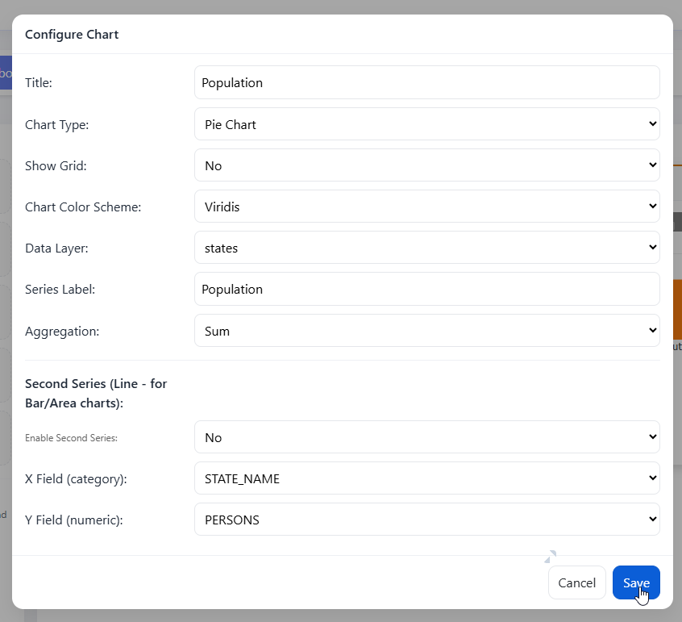

The Chart has now been created

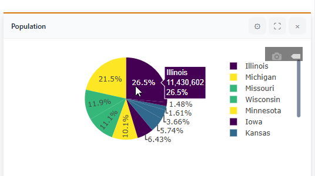

To add a Second Series, set Enable Second Series to Yes (Only for Bar and Area Charts)

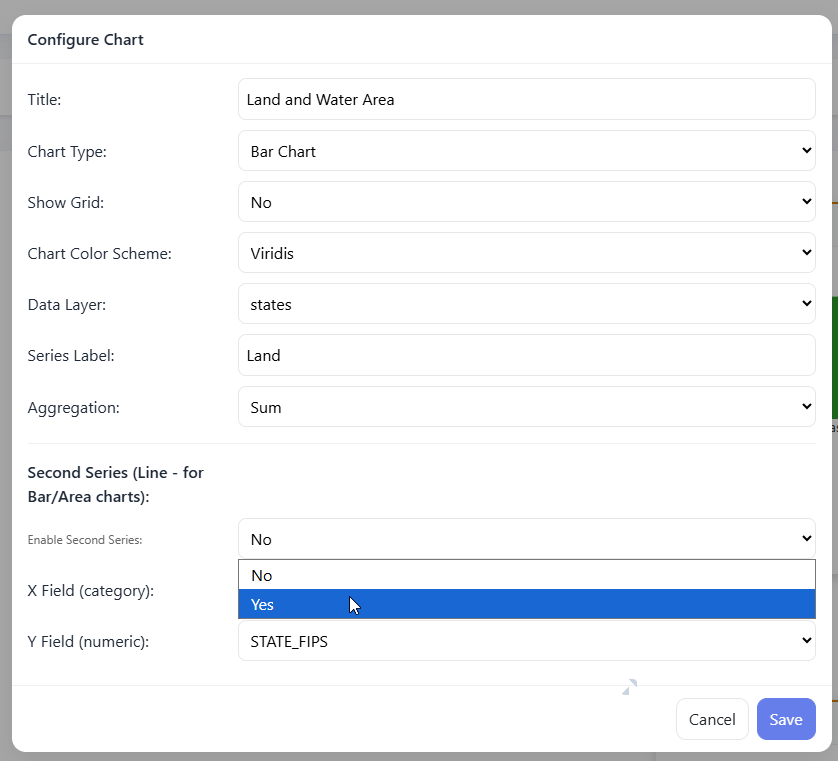

Select Second Series X and Y and label

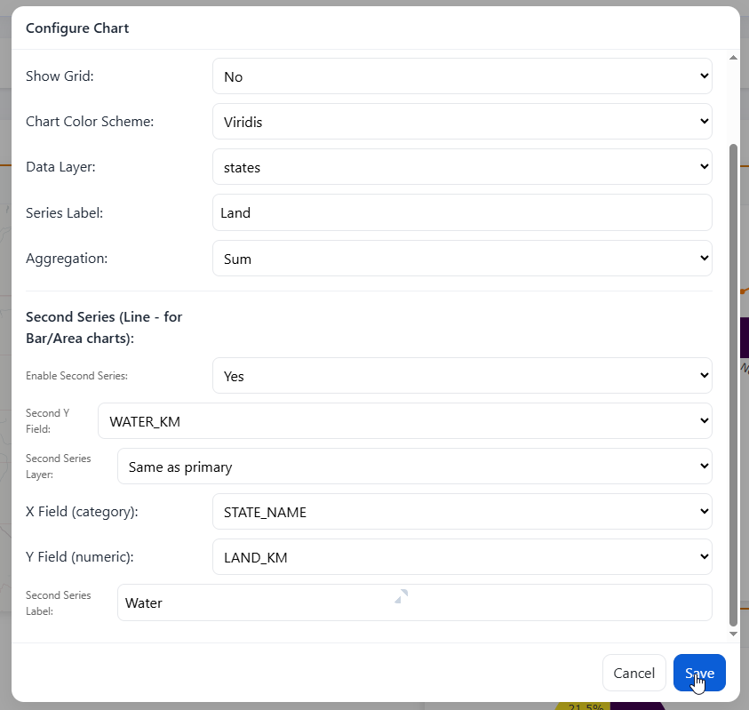

The Chart has now been created.

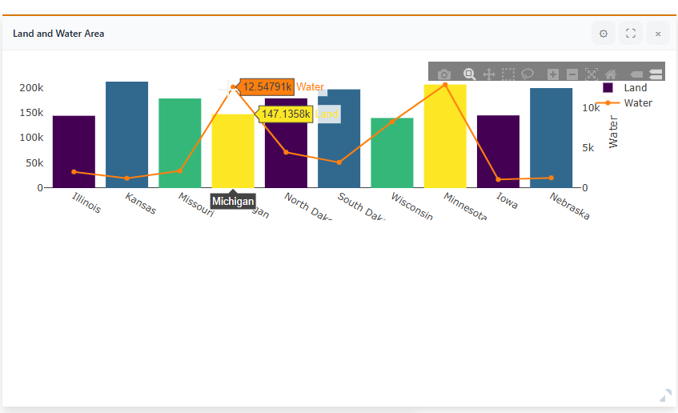

Data Tables
================

Click on the Table widget

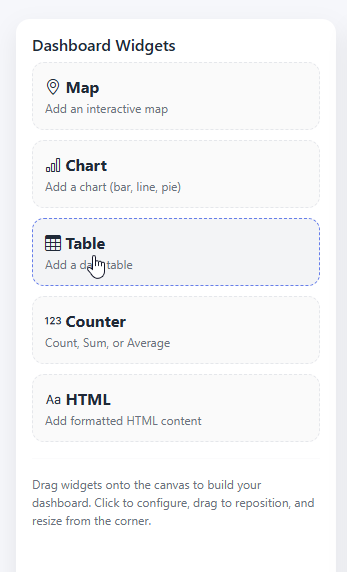

Click the configure button

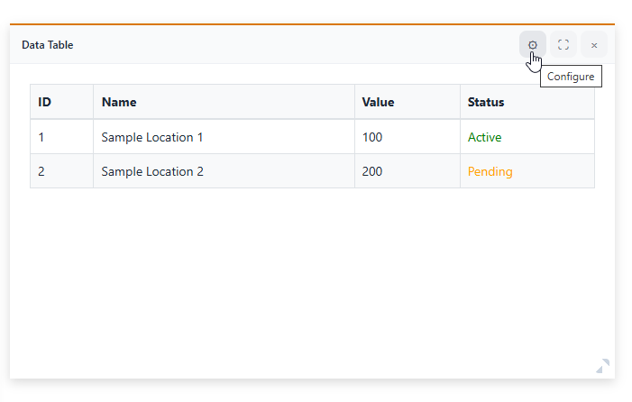

Enter a title, and select data layer and column(s)

Note that column order can be set by dragging columns up or down

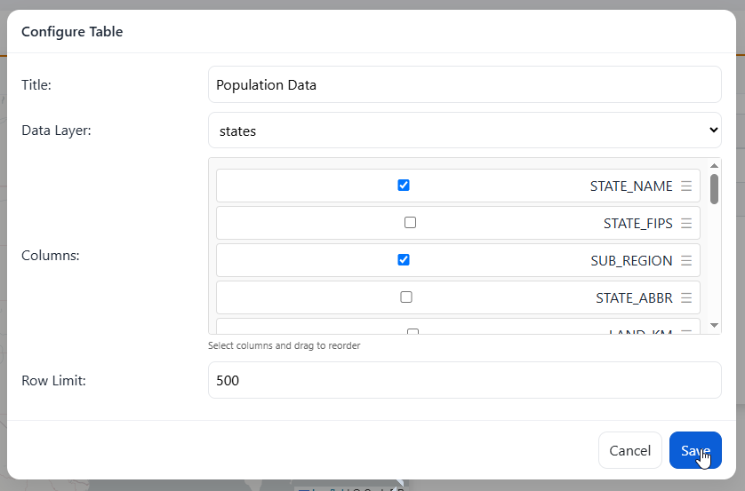

Data Tabls has been created

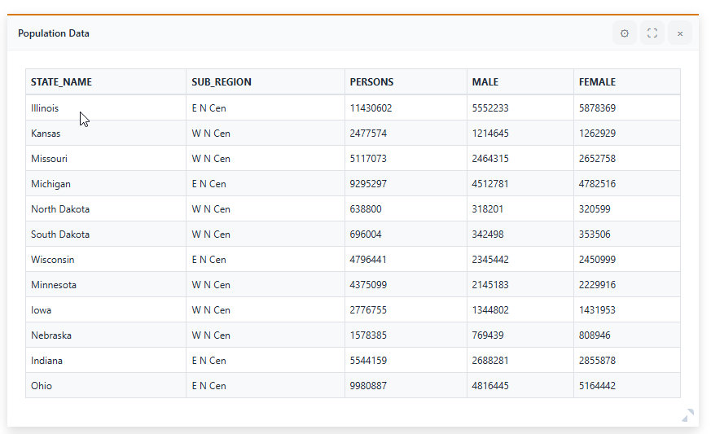

Counter
================

Click the Counter widet

.. image:: ../../_static/GeoLite-Dashboard-20.png

Click the Configure button

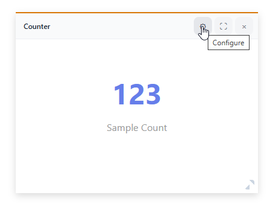

Enter a title, select a data layer and operation (Count, Sum, etc..) and Field

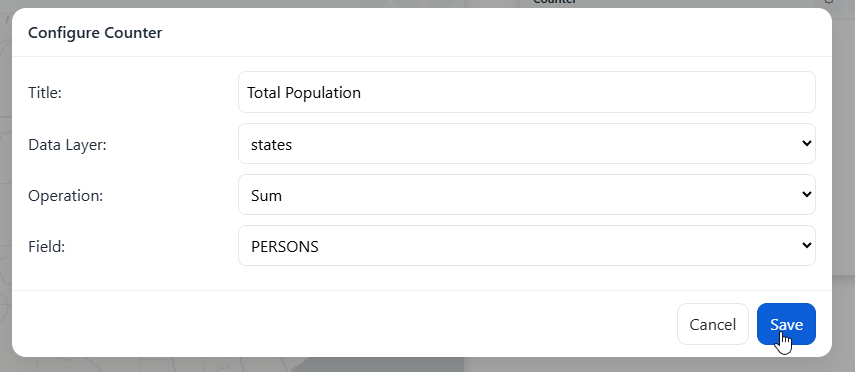

The Counter has been added

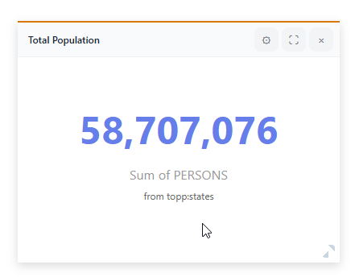

HTML
================

Click on the HTML widget

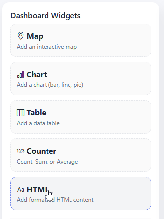

Click the Configure button

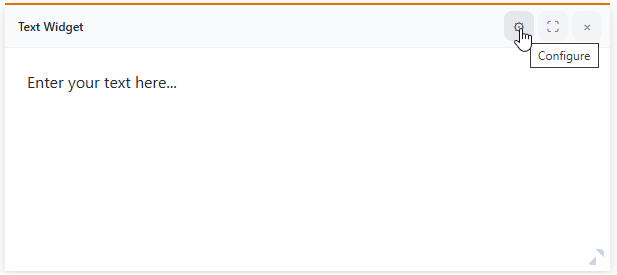

Add and style your HTML content

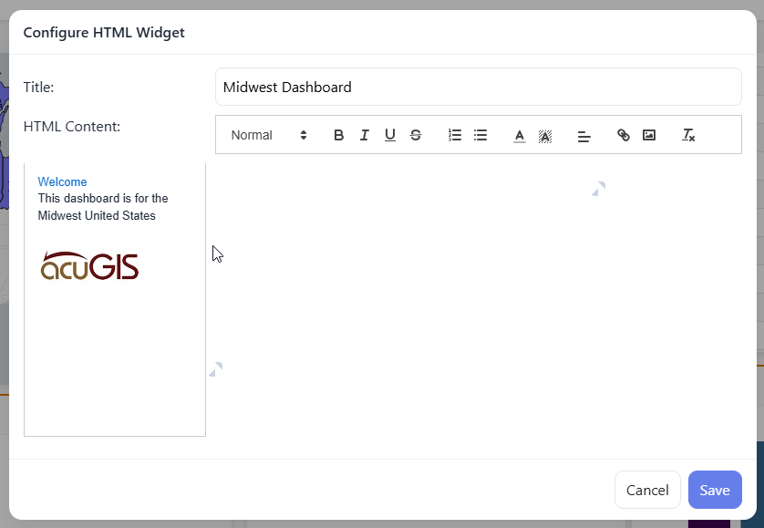

Click save

Your HTML widget has been added

Save Dashboard
======================

When ready click the Save button at top left

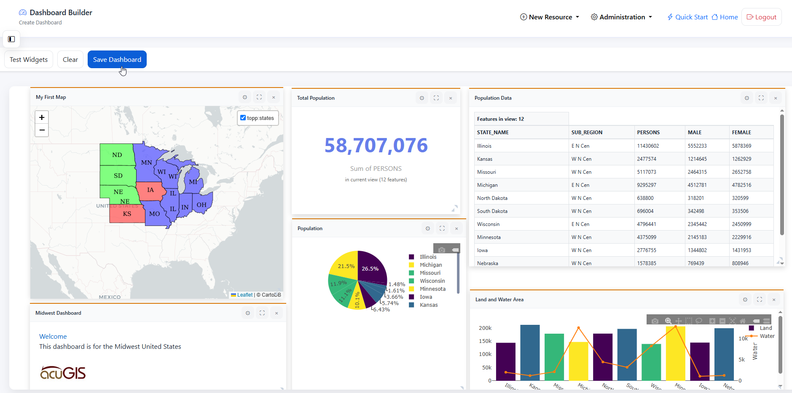

Give your Dashboard a Title, Description, and (optionally) select a Category

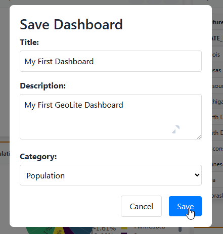

Dashboard Thumbnail
=====================

To set a thumbnail for the Dashboard, select Thumbnail on the menu

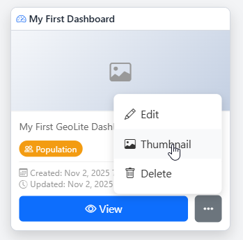

Browse to image you wish to use

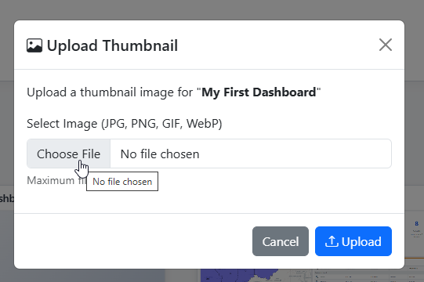

Click Upload

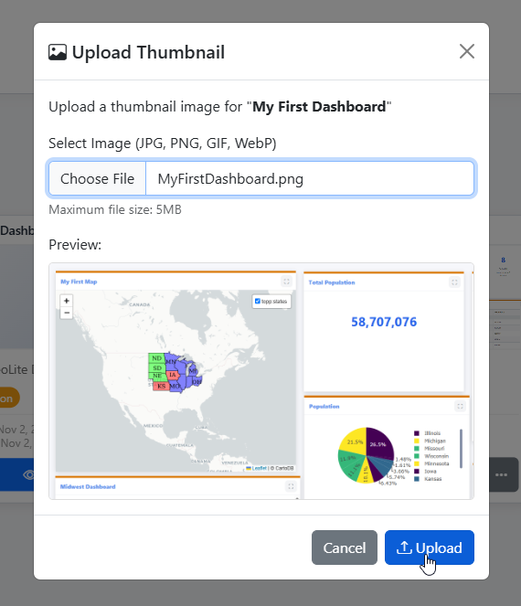

Your thumbnail has now been set

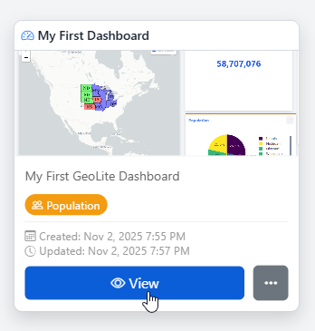

Edit Dashboard
=====================

To edit a Dashboard, click the edit link

Make any changes or updates, making sure to click Save as you go

Delete Dashboard
===================

To delete a Map, click the delete icon

