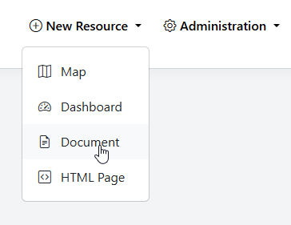
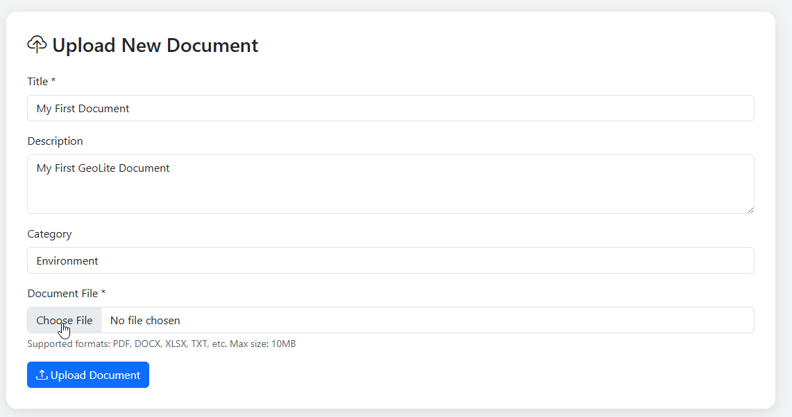
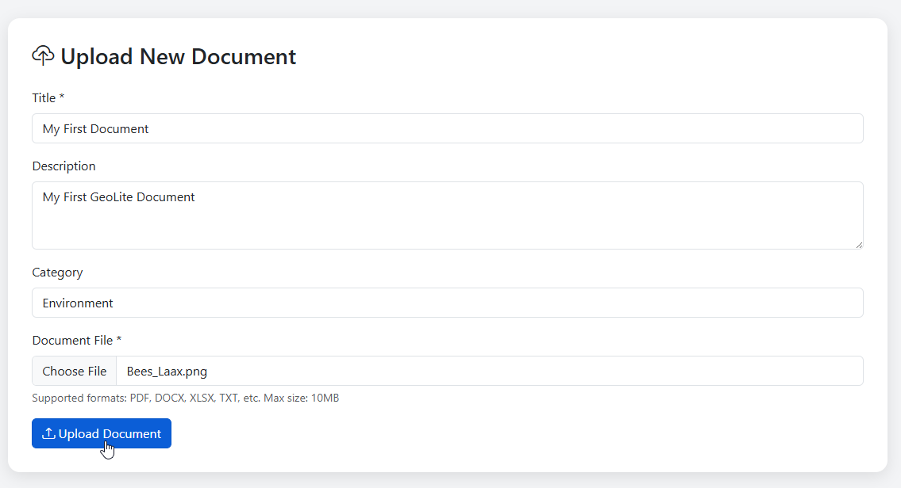
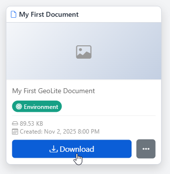

.. This is a comment. Note how any initial comments are moved by
   transforms to after the document title, subtitle, and docinfo.

.. demo.rst from: http://docutils.sourceforge.net/docs/user/rst/demo.txt

.. |EXAMPLE| image:: static/yi_jing_01_chien.jpg
   :width: 1em

**********************
Documents
**********************
.. contents:: Table of Contents
Overview
==================

Documents can be uploaded to GeoLite and use Permissions like other Resources.

Create Document
================

To add a new Document, go to Add Resource > Document

Give your Document a Name, Description, and (optionally) select a Category

Browse to the location of file

Click Upload Document

Your Document has now been added

Document Thumbnail
=====================

To set a thumbnail for the Document, select Thumbnail on the menu

Chose your thumnail and click Upload

Edit Document
=====================

To edit a Document, click the edit link

Make any changes or updates, making sure to click Update Map as you go

Once completed, click the Update button

Delete Document
===================

To delete a Document, click the delete icon

