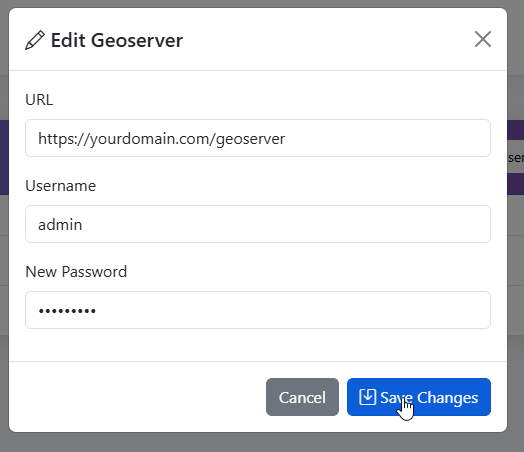
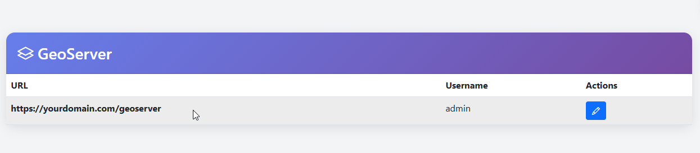

.. This is a comment. Note how any initial comments are moved by
   transforms to after the document title, subtitle, and docinfo.

.. demo.rst from: http://docutils.sourceforge.net/docs/user/rst/demo.txt

.. |EXAMPLE| image:: static/yi_jing_01_chien.jpg
   :width: 1em

**********************
GeoServer
**********************
.. contents:: Table of Contents
Overview
==================

In order access your GeoServer layers, you will need to enter credentials for a REST user.

Below, we are using user 'admin'.

Settings
================

To set GeoServer credntials, go to Administation > Manage Users

.. image:: ../../_static/GeoLite-Users-1.png

Enter your GeoServer URL and the REST username and password

Your GeoServer information is now added
  

Edit 
=====================

To edit GeoServer settings, click on edit button

Make the desired edits and click Update

