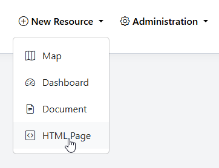
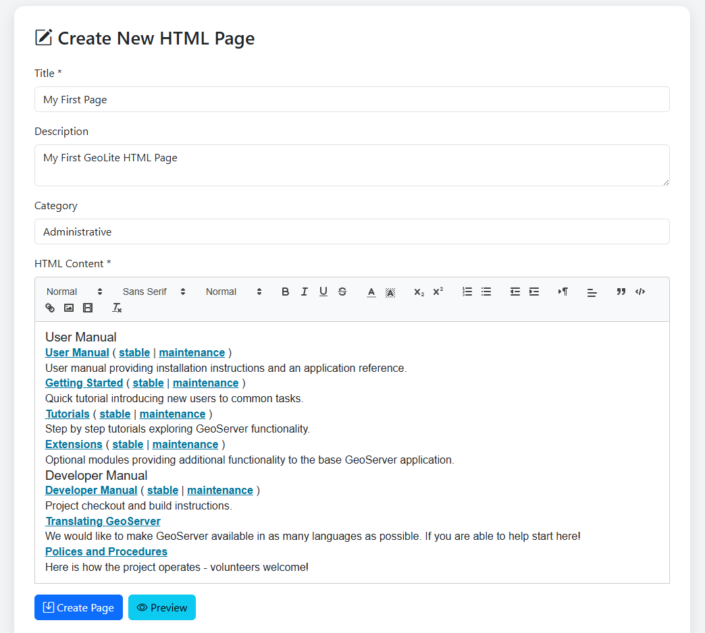
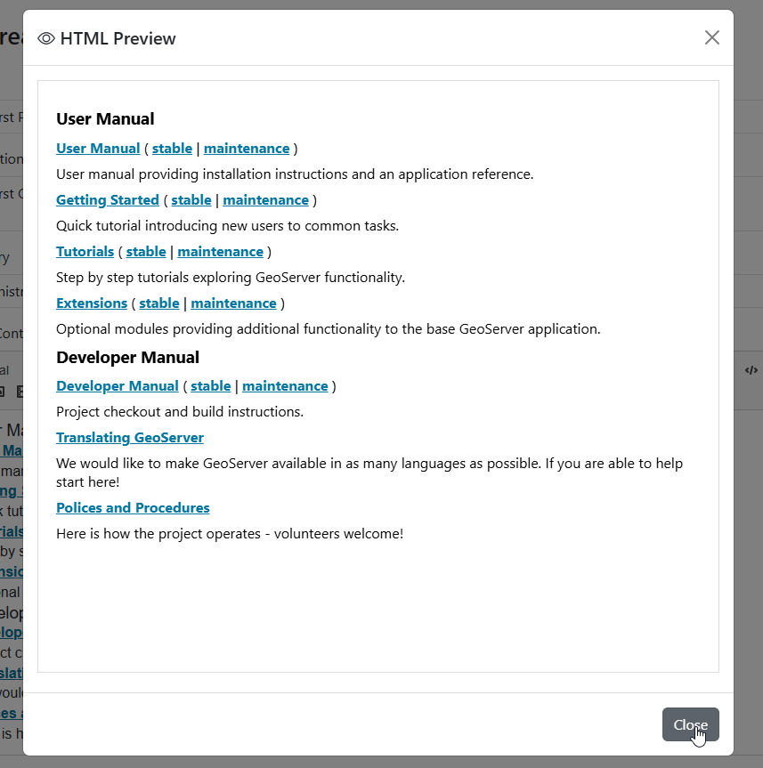
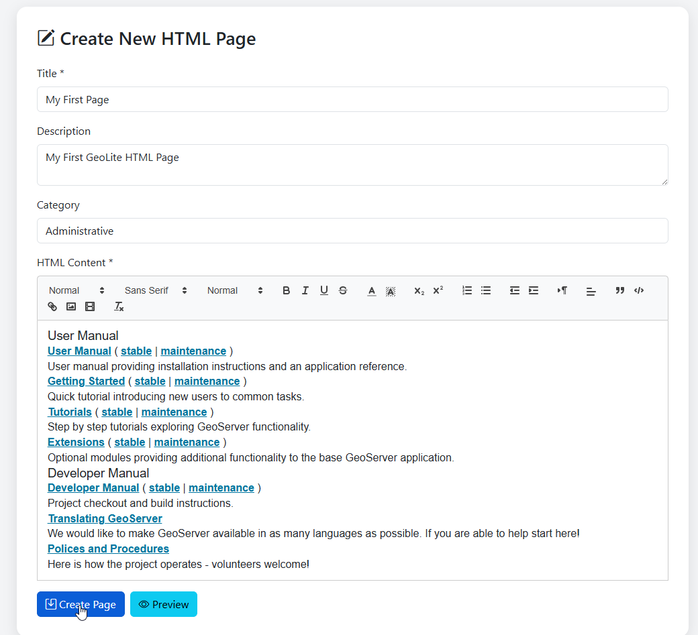
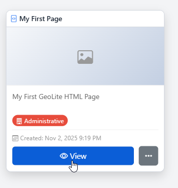
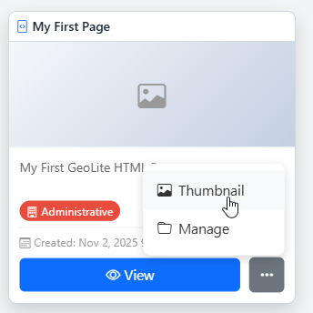
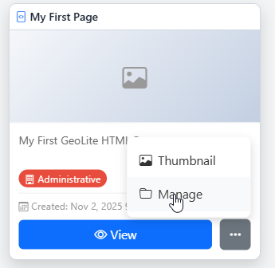
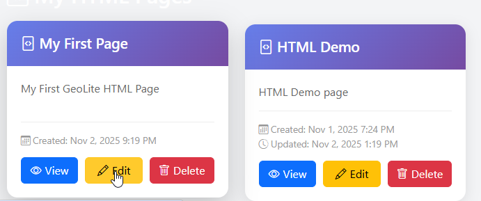

.. This is a comment. Note how any initial comments are moved by
   transforms to after the document title, subtitle, and docinfo.

.. demo.rst from: http://docutils.sourceforge.net/docs/user/rst/demo.txt

.. |EXAMPLE| image:: static/yi_jing_01_chien.jpg
   :width: 1em

**********************
HTML
**********************
.. contents:: Table of Contents
Overview
==================

HTML widgets are used to add HTML and media content.

Create HTML
================

To add a new HTML page, go to Add Resource > HTML

Enter the Title, Description, and (optionally), a Category.

Enter and style your HTML content

Use the Preview button to preview the content

Click Create Page

The HTML widget is created:

HTML Thumbnail
=====================

To set a thumbnail for the HTML widget, select Thumbnail on the menu

Upload the thumbnail image you wish to use

Edit HTML
=====================

To edit a Map, click the Manage link

On the HTML management page, click Edit for your HTML widget

Make any changes or updates, making sure to click Update when done.

Delete HTML
===================

To delete a HTML widget, click the delete icon for the widget on the HTML management page.

