.. This is a comment. Note how any initial comments are moved by
   transforms to after the document title, subtitle, and docinfo.

.. demo.rst from: http://docutils.sourceforge.net/docs/user/rst/demo.txt

.. |EXAMPLE| image:: static/yi_jing_01_chien.jpg
   :width: 1em

**********************
Maps
**********************
.. contents:: Table of Contents
Overview
==================

Maps are created from your GeoServer layers

Create Map
================

To add a new Map, go to Add Resource > Map

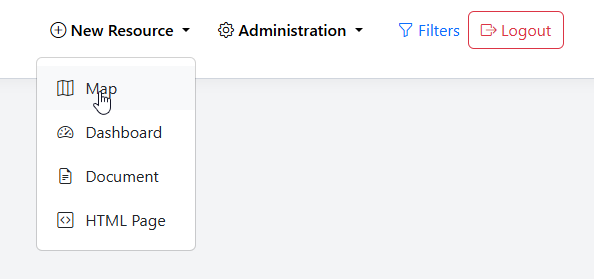

Give your Map a name and description.

Optionally, select a Category

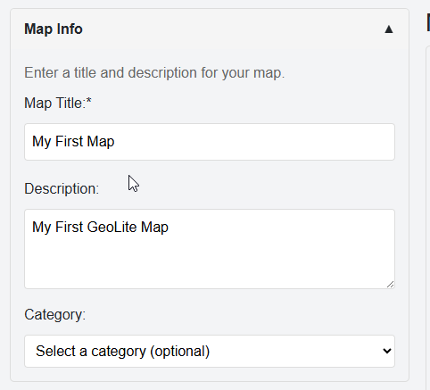

Select the GeoSever layers to include:

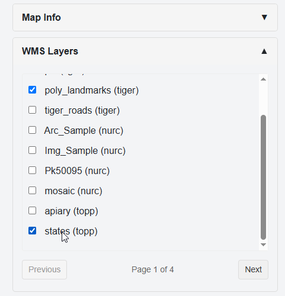

Select Basemap(s) to include

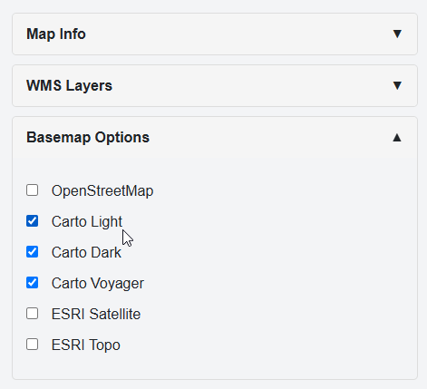

Select Map Features to include

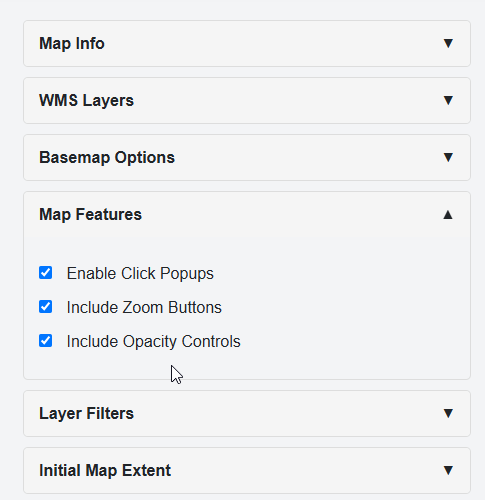

Filters can be added only once the Map is saved

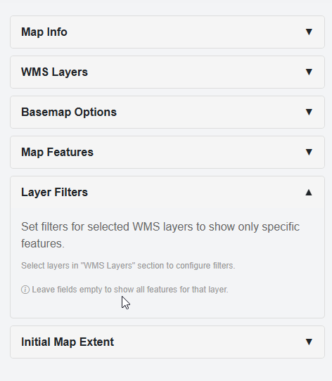

Click Generate Map

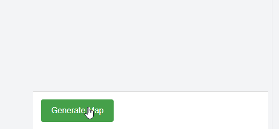

The generated map is displayed in the preview pane

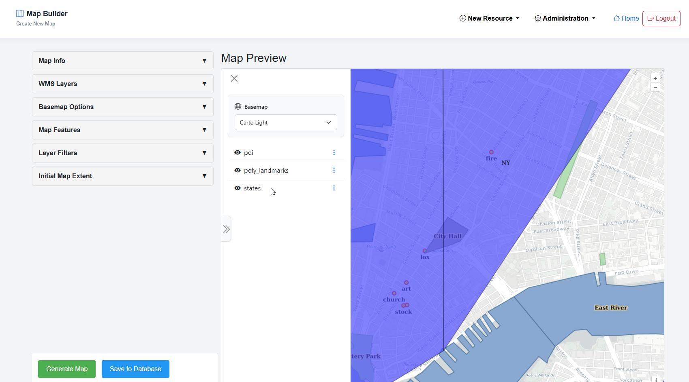

Adjust the desired initial extent

.. image:: ../../_static/map-9.png

Under Initial Extent, click the Capture Current Position

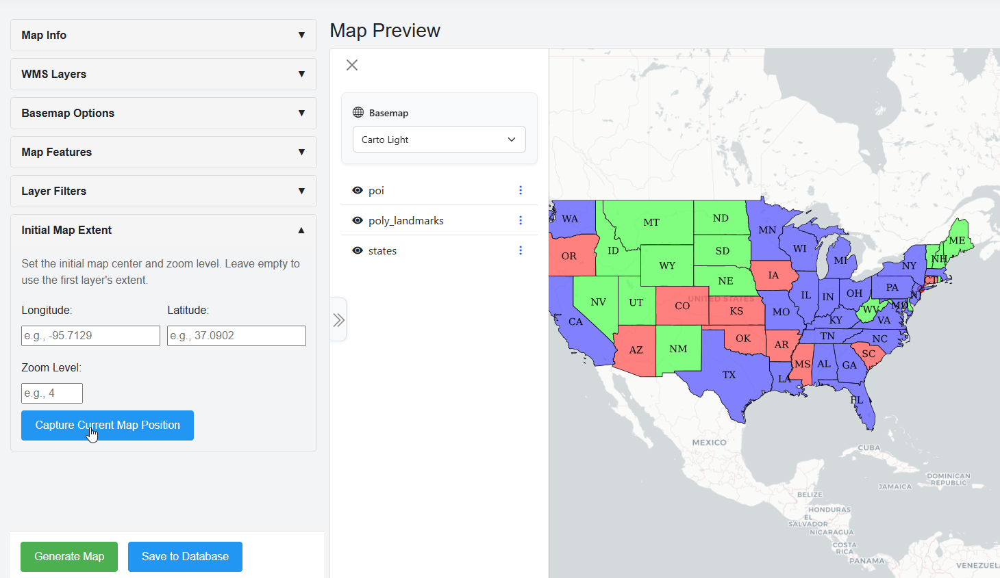

The current Map position is populated

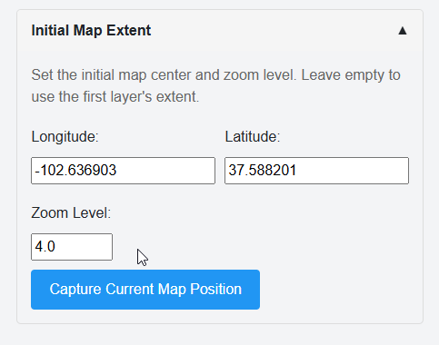

Click Generate Map

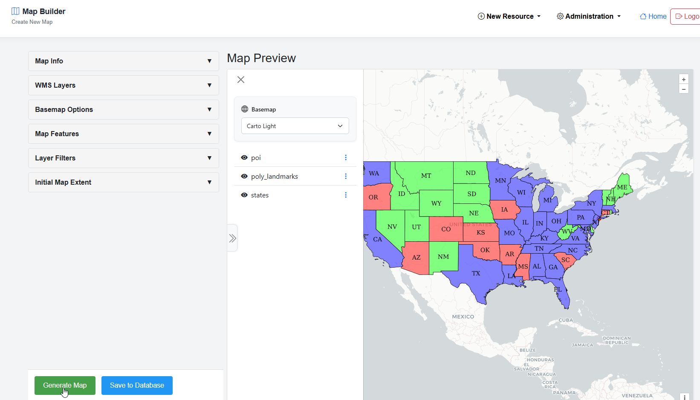

When you have completed your Map, click the Save to Database button

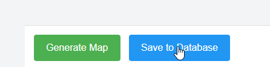

Your Map has now been created:

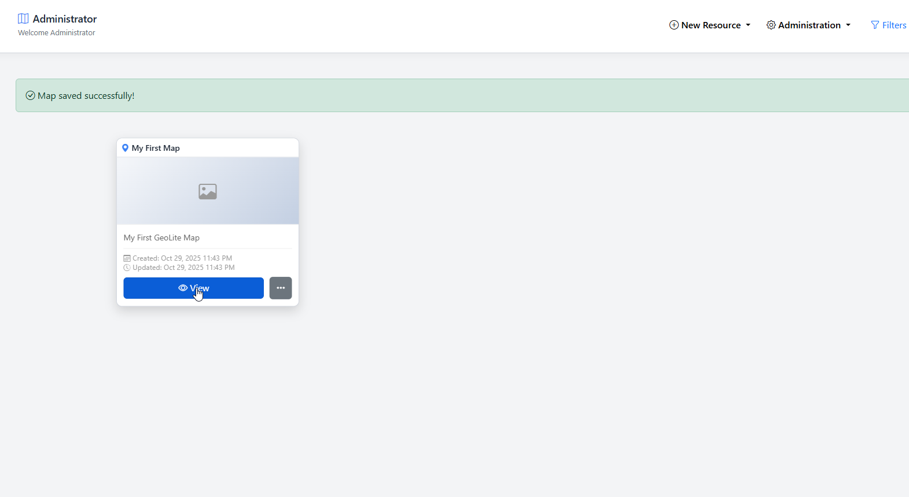

Map Thumbnail
=====================

To set a thumbnail for the map, select Thumbnail on the menu

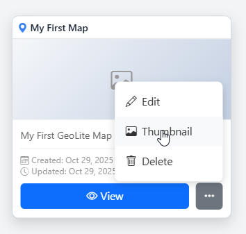

Chose your thumnail and click Upload

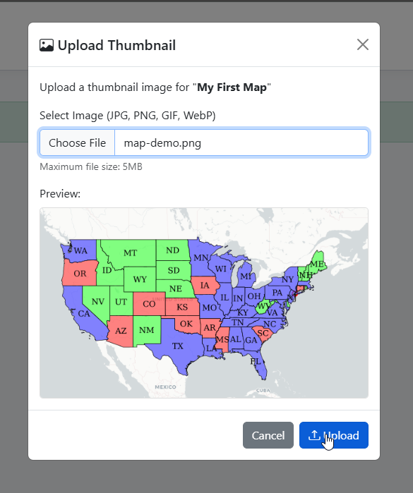

The Map thumbnail has now been set

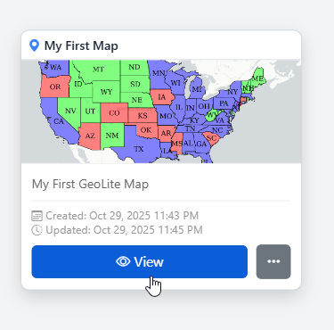

Edit Map
=====================

To edit a Map, click the edit link

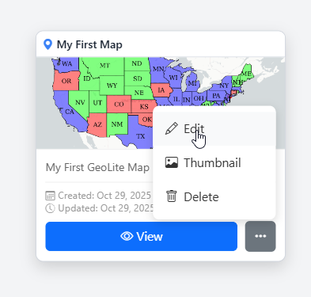

Make any changes or updates, making sure to click Update Map as you go

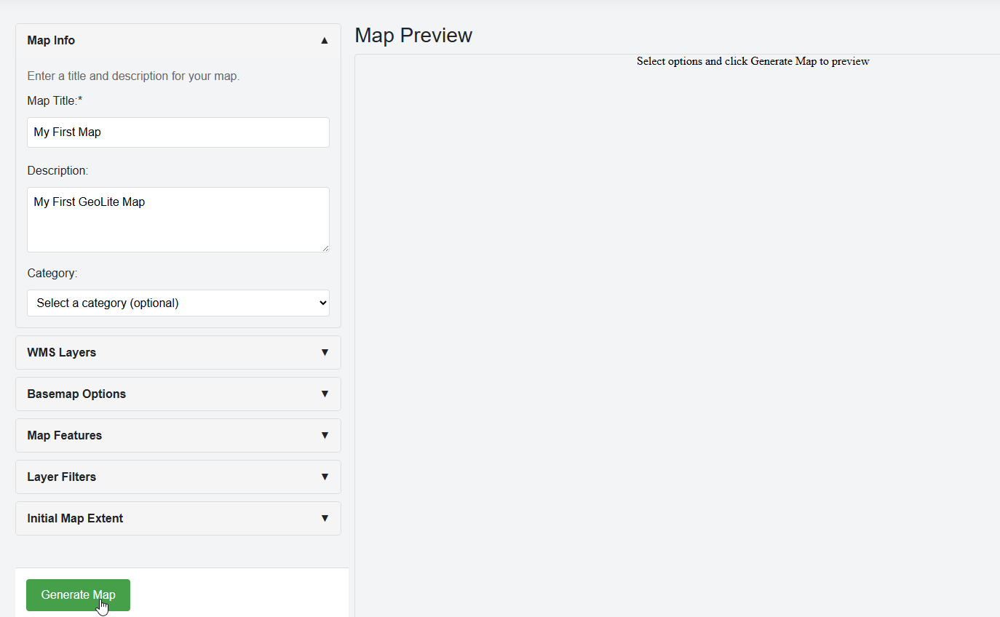

Once completed, click the Update Map button

Map Filters
===============================

To add a Map filter, expand the Layer Filter section

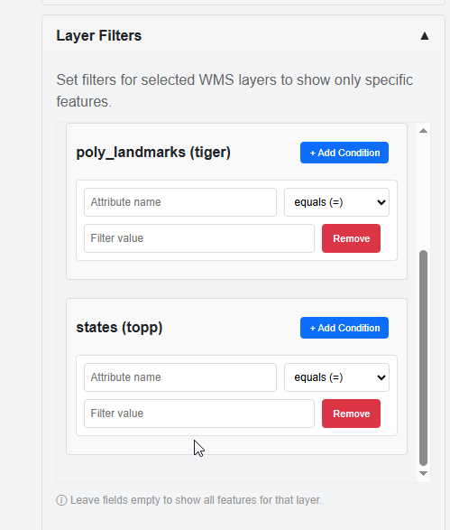

Add any Filters you wish to add

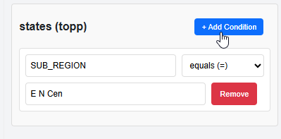

For multiple Filters on same layer, click "Add Condition"

be sure to select "And" or "Or" as needed

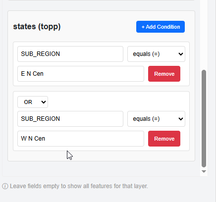

Click Generate Map

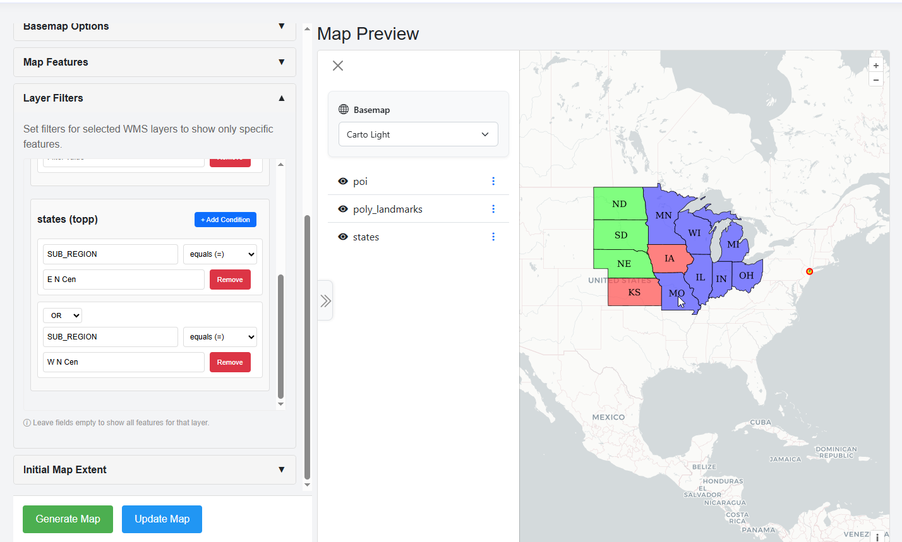

Your Map is now Filtered

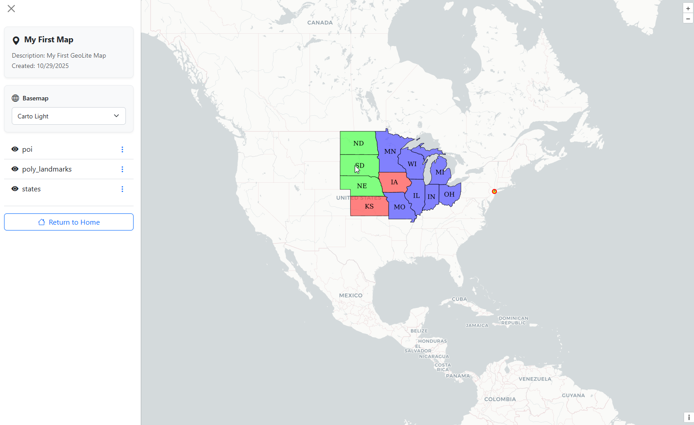

Delete Map
===================

To delete a Map, click the delete icon

