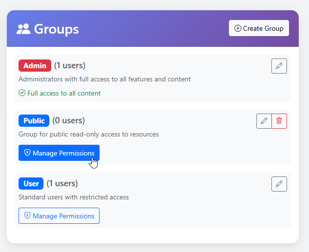
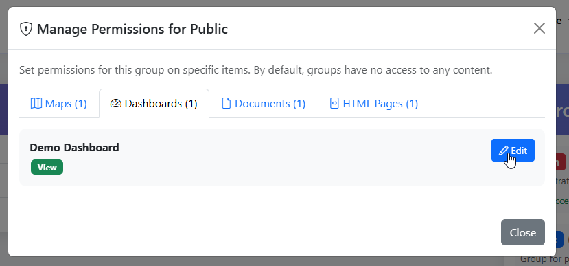
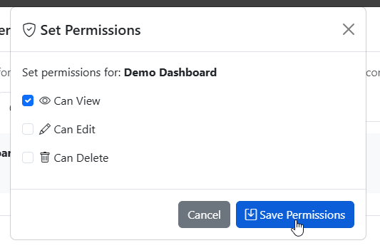

.. This is a comment. Note how any initial comments are moved by
   transforms to after the document title, subtitle, and docinfo.

.. demo.rst from: http://docutils.sourceforge.net/docs/user/rst/demo.txt

.. |EXAMPLE| image:: static/yi_jing_01_chien.jpg
   :width: 1em

**********************
Permissions
**********************
.. contents:: Table of Contents
Overview
==================

Permissions on Resources (Maps, Dashboard, Documents, and HTML) are assigned to Groups via the Users page

Grant
================

To assign permissions for a Resource, go to Administation > Manage Users

.. image:: ../../_static/GeoLite-Users-1.png

Click the Manage Permissions button for the Group

Go to the tab(s) for the resource and click the Edit button
  

Assign the permissions you want for the Group

Edit Permissions
=====================

To edit permissions, click on Manage Permissions button.

Make the desired edits and click Update

Revoke
===================

To Revoke permissions, click on Manage Permissions button.

Revoke the desired permissions and click Update

