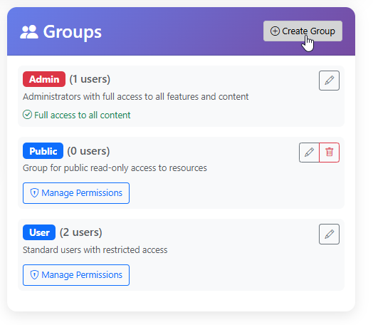
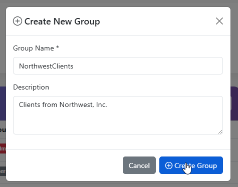
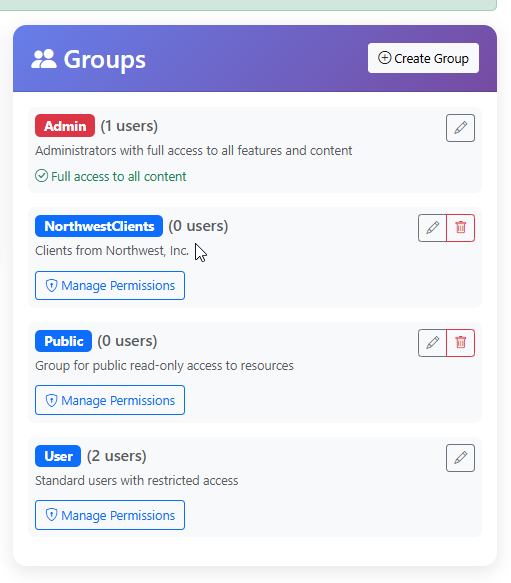

.. This is a comment. Note how any initial comments are moved by
   transforms to after the document title, subtitle, and docinfo.

.. demo.rst from: http://docutils.sourceforge.net/docs/user/rst/demo.txt

.. |EXAMPLE| image:: static/yi_jing_01_chien.jpg
   :width: 1em

**********************
User Groups
**********************
.. contents:: Table of Contents
Overview
==================

Report permissions are granted to User Groups.

Add New Group
================

To add a new Group, click the "Create" button at top.

Enter a Name for the Group and a Description

The Group has now been created

Add and Edit Members
=====================

Group members are added and edited via the User profile.

Delete Group
===================
To delete a Group, click the Delete icon.

