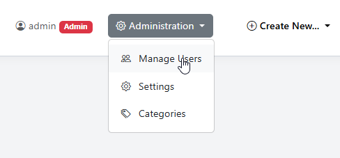
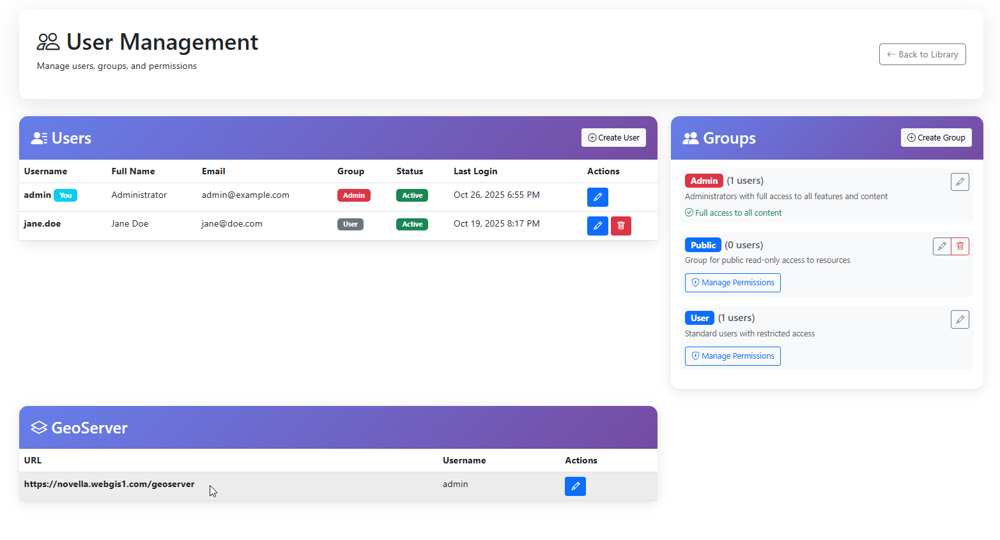
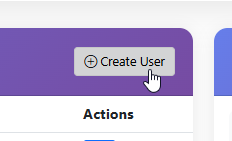
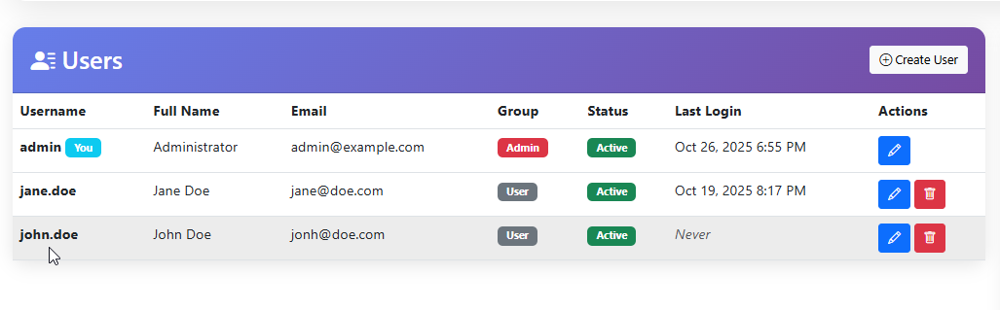
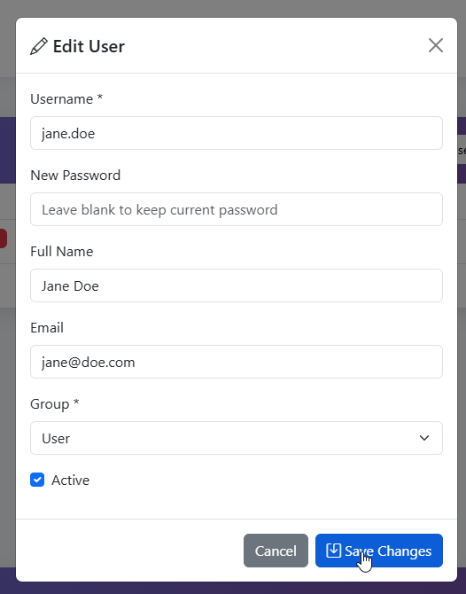

.. This is a comment. Note how any initial comments are moved by
   transforms to after the document title, subtitle, and docinfo.

.. demo.rst from: http://docutils.sourceforge.net/docs/user/rst/demo.txt

.. |EXAMPLE| image:: static/yi_jing_01_chien.jpg
   :width: 1em

**********************
Users
**********************
.. contents:: Table of Contents
Overview
==================

Novella includes basic role based permissions.

User Types
==================

GeoLite supports the following User types.

Additional types can be added.

- Admins:  All system privilages
- Users:   Can view resources for which they have permission

Add New User
================

To create a new user, click on Manage Users in the Administration menu.

Users page looks like below

Click the Create button

Populate the new User information

.. image:: ../../_static/GeoLite-Users-4.png

The User has been created.

Assign User to Group
=======================

You can assign a User to Group during creating or via edit.

Edit User
===================

You can edit users via the Edit link.

Delete User
===================

You can delete users via the Delete link.

