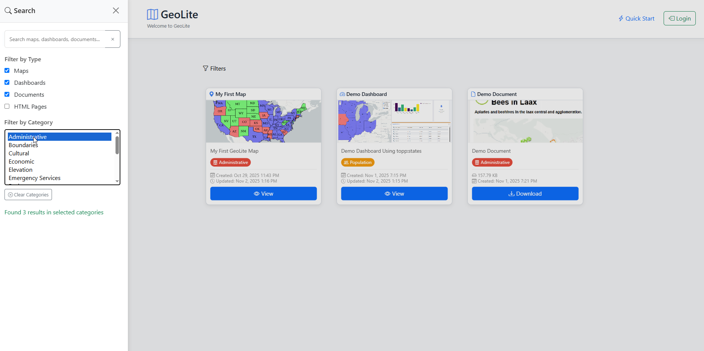

Intro
===========================

Overview
------------

GeoLite is a lightweight Map and Dashboard builder for GeoServer.

It requires only PHP and PotgreSQL and Apache HTTP Server (or Nginx)

Authors
-------
* `David Ghedini`_
* `AcuGIS`_

.. _`David Ghedini`: https://github.com/DavidGhedini
.. _`AcuGIS`: https://www.acugis.com

Components
-------------

* PostgreSQL
* PHP
* Apache HTTP Server
* GDAL

Open Source
-----------

Novella is free, Open Source software.

GNU GENERAL PUBLIC LICENSE v3

    

